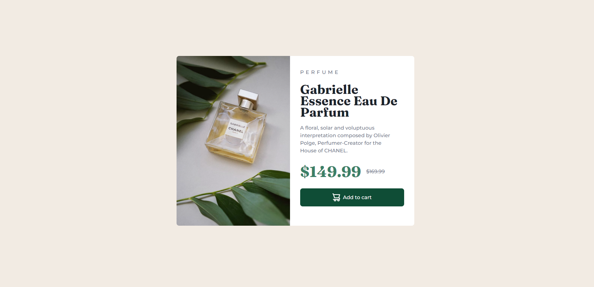
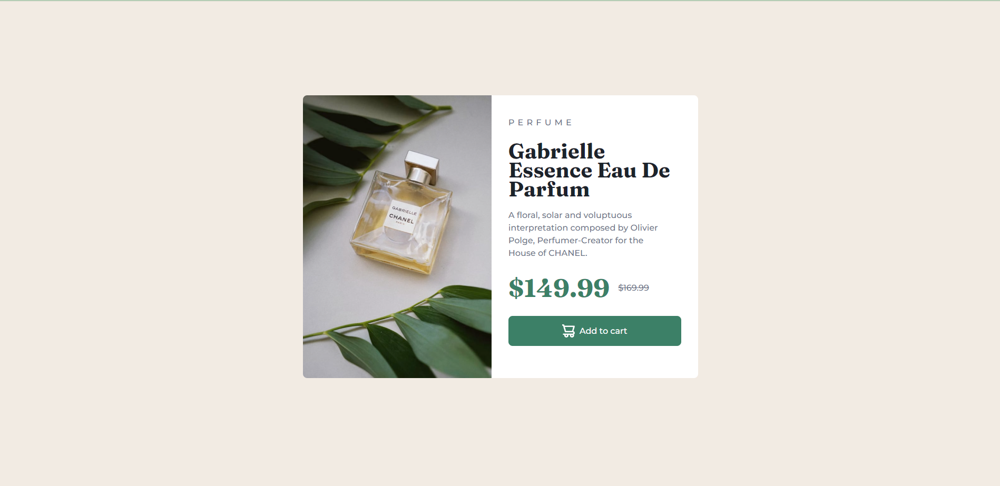

# Frontend Mentor - Product preview card component

### Screenshot

### Links

- Live Site URL: https://marvelous-paletas-7c8d61.netlify.app/

### Built with

- Semantic HTML5 markup
- CSS custom properties
- Flexbox
- Mobile-first workflow

## Author

- Frontend Mentor - [@romyanand](https://www.frontendmentor.io/profile/romyanand)
- Twitter - [@romytwts](https://twitter.com/romytwts)