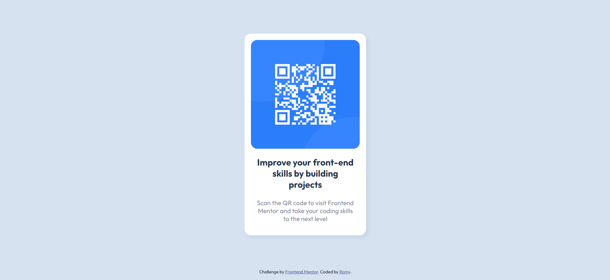

# Frontend Mentor - QR code component solution

This is a solution to the [QR code component challenge on Frontend Mentor](https://www.frontendmentor.io/challenges/qr-code-component-iux_sIO_H). Frontend Mentor challenges help you improve your coding skills by building realistic projects. 

## Table of contents

- [Overview](#overview)
  - [Screenshot](#screenshot)
  - [Links](#links)
- [My process](#my-process)
  - [Built with](#built-with)
- [Author](#author)
- [Acknowledgments](#acknowledgments)

### Screenshot

### Links

- Solution URL: https://www.frontendmentor.io/solutions/responsive-qrcode-component-using-html-and-css-am6E-ryK9R
- Live Site URL: https://fancy-rolypoly-e7bb5f.netlify.app/

## My process

### Built with

- Semantic HTML5 markup
- CSS custom properties
- Mobile-first workflow

## Author

- Frontend Mentor - [@romyanand](https://www.frontendmentor.io/profile/romyanand)
- Twitter - [@romytwts](https://twitter.com/romytwts)
